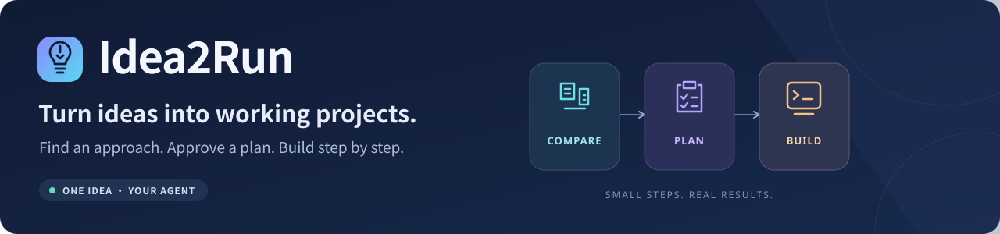

<p align="center">
  
</p>

<p align="center">
  <strong>One idea. Clear options. An approved plan. A practical next step.</strong>
</p>

<p align="center">
  <a href="https://github.com/wangyangwjy/idea2run/releases/latest"></a>
  <a href="https://github.com/wangyangwjy/idea2run/actions/workflows/release.yml"></a>
  <a href="LICENSE"></a>
</p>

<p align="center">
  <a href="README.md">简体中文</a> · <strong>English</strong>
  <br>
  <a href="#quick-start">🚀 Quick start</a> · <a href="https://github.com/wangyangwjy/idea2run/releases/latest">📦 Latest download</a> · <a href="docs/compatibility.en.md">🔌 Agent compatibility</a> · <a href="#updating-an-existing-installation">↻ Update guide</a>
</p>

Current version: **v0.3.1** · [Changelog](CHANGELOG.en.md) · [Development docs](docs/development.en.md)

Describe an idea, compare open-source approaches, approve a plan, and implement it step by step. Use your existing Codex, Claude Code, Hermes Agent, OpenClaw, or Pi; Idea2Run adds no account or model API.

| 🧭 Choose an approach | 🗂️ Approve a plan | 🤝 Hand off in stages |
| --- | --- | --- |
| Compare real projects, including environment, downloads, and adaptation effort | Review the complete plan before approving implementation | One stage at a time, continuing or repairing based on actual feedback |

---

## Quick start

### ① 🧭 Choose your Agent and scope

| Your Agent | Installation option | Start using it |
| --- | --- | --- |
| Codex | `--agent codex` (default) | `$idea2run your idea` |
| Claude Code | `--agent claude-code` | `/idea2run your idea` |
| Hermes Agent | `--agent hermes` | `/idea2run your idea` |
| OpenClaw | `--agent openclaw` | `/idea2run your idea`, or ask it to use Idea2Run |
| Pi coding agent | `--agent pi` | `/skill:idea2run your idea` |

**One project**: choose project-local installation (default). **Across projects**: explicitly choose global installation for the current user. For OpenClaw, local means its actual workspace. Hermes project discovery requires a version supporting it, a Git project, and user trust. Discovery scope varies by host; see [compatibility and validation](docs/compatibility.en.md).

### ② 📦 Install

**Let your current Agent install it.** Open it in the target project or workspace and copy this prompt, filling in your Agent and scope:

```text
Install Idea2Run: https://github.com/wangyangwjy/idea2run . My Agent is <Codex / Claude Code / Hermes Agent / OpenClaw / Pi>, and my scope is <current project or workspace / global for the current user>. Read the latest README, obtain the latest release, and install in the environment where the host actually runs. Tell me the version, scope, entry point, and first-use instructions.
```

<details>
<summary>🛠️ Install it yourself: download, extract, run one command</summary>

Requires an existing Agent and Node.js 22+. Download the full ZIP from the [latest release](https://github.com/wangyangwjy/idea2run/releases/latest), extract it, and open a terminal in the folder containing `package.json`. Choose your Agent and replace the path with your actual working project:

```powershell
# Example: Claude Code in one project
node scripts/install-skill.mjs "D:\your-project" --agent claude-code

# Example: Pi globally for the current user
npm run setup -- --agent pi --global
```

Codex can omit `--agent codex`. Omitting the target installs into the extracted directory itself; do this only when it is your working project. For WSL, containers, or remote hosts, install inside the actual runtime environment using its paths. The chat client may run on a different computer. Installation does not change host configuration or trust settings.

</details>

### ③ 💬 Describe your idea

Start a new session of the selected Agent within the chosen scope and use the command in the table, for example:

```text
/idea2run I want to build a local photo organizer
```

Then reply with “choose option two,” “approved,” or “continue.” Follow the entry and host-specific instructions printed by the installer. If discovery fails, start a new session in the correct project/workspace and check trust, skill switches, and the entry path. You can ask the Agent to read that `SKILL.md` directly and follow its workflow. Existing Pi sessions can use `/reload`. With duplicate copies, check host precedence and the actual loaded path.

Other Agents without native skill discovery can read `plugins/idea2run/skills/idea2run/SKILL.md` and its references from the extracted package. Without file-reading tools, the user can supply the skill text and currently needed references. An Agent without execution tools can still provide options, plans, and staged prompts.

## What happens during use

```text
Describe → Clarify key needs → Compare short options → Choose → Approve the full plan → Work step by step → Receive outputs and usage instructions
```

| What you need | What Idea2Run provides |
| --- | --- |
| 🎯 Clarify requirements | The goal, inputs, outputs, and success criteria, with grouped questions about gaps that affect the choice |
| 🔎 Choose an approach | Usually 2–3 short options: ready to use, adaptation required, or development required, with environment, downloads, effort, and unknowns |
| 🗂️ Know what comes next | A complete plan for the chosen approach, including outputs, checks, and failure handling |
| 🤝 Have an Agent execute | One short prompt per stage, for the current Agent or another Agent |
| ↻ Continue or repair | Paste actual results into the original conversation; continue after checks pass or fix the current stage |
| ✅ Use the result | Four fixed items: what was built, how to start it, how to use it, and what remains unfinished, with a direct entry point |

You choose the approach, approve the plan, and decide whether to let an Agent execute. Recommendations have real sources; download sizes, compatibility, and timings stay unknown without evidence. Documented support does not prove execution in your environment. Changes to the plan require reviewing the relevant approvals.

## Updating an existing installation

The example uses Claude Code; use the table above for other Agents. First download and extract the [latest release](https://github.com/wangyangwjy/idea2run/releases/latest). From the **new extracted directory**, run the command matching your existing scope:

```powershell
# Project-local: target the original working project
node scripts/install-skill.mjs "D:\your-project" --agent claude-code --update

# Global for the current user
npm run setup -- --agent claude-code --global --update
```

The installer prints the full old-copy backup path and preserves local edits and progress. Confirm the version and scope in the output, then start a new session of the corresponding Agent within that scope. Copies for different hosts, projects, and global scopes are separate; updating one does not update the other. Marketplace users follow the [marketplace update instructions](docs/development.en.md#repository-marketplace-plugin).

## Common questions

<details>
<summary>🌐 What if web search is unavailable?</summary>

Idea2Run explains the limitation, uses materials you provide, or leaves candidates unverified.

</details>

<details>
<summary>🔌 Which Agents are supported?</summary>

Native skill-directory installation is provided for the five hosts above, using one shared workflow. File installation, host discovery, and complete in-host use are verified separately; see [compatibility and validation](docs/compatibility.en.md). Other Agents can read the skill directly or receive a current-stage prompt.

</details>

<details>
<summary>💳 Do I need to pay or install a local model?</summary>

Idea2Run adds no account, cloud service, or model API. Host costs and the chosen approach's downloads, hardware, and service requirements depend on the actual environment.

</details>

## Development and feedback

The plugin provides clarification, option comparison, plan approval, staged handoff and feedback, four fixed delivery items, and safe project-local/global updates. Twenty-four automated tests cover progress, handoff, installation scope, updates, and path protection. Actual local handoffs, installation checks, and user feedback are recorded separately; synthetic samples are not evidence of business execution.

Each version synchronizes GitHub source, its tag, Release, and download package, with matching bilingual documentation and manifests. See the [development and release workflow](docs/development.en.md#version-releases-and-github-synchronization). Acceptance focuses on plugin usability; extra sample-application or host-Agent tests are not gates for this delivery.

Report actual issues through [Issues](https://github.com/wangyangwjy/idea2run/issues). Progress is saved locally under `.idea2run/` when needed; private conversations, machine information, and user outputs are excluded from the public repository and download package.

## License

[MIT](LICENSE). Candidate projects, dependencies, and user samples retain their own licenses.
