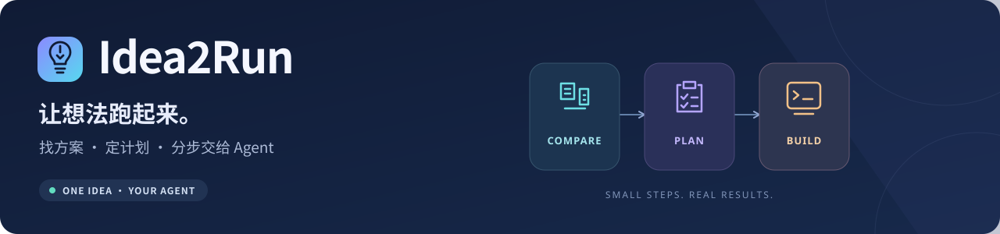

<p align="center">
  
</p>

<p align="center">
  <strong>把一句想法，变成可选择的方案、可确认的计划和可执行的下一步。</strong>
</p>

<p align="center">
  <a href="https://github.com/wangyangwjy/idea2run/releases/latest"></a>
  <a href="https://github.com/wangyangwjy/idea2run/actions/workflows/release.yml"></a>
  <a href="LICENSE"></a>
</p>

<p align="center">
  <strong>简体中文</strong> · <a href="README.en.md">English</a>
  <br>
  <a href="#快速上手">🚀 快速上手</a> · <a href="https://github.com/wangyangwjy/idea2run/releases/latest">📦 下载最新版</a> · <a href="docs/compatibility.zh-CN.md">🔌 Agent 兼容</a> · <a href="#已有用户怎么更新">↻ 更新指南</a>
</p>

当前版本：**v0.3.1** · [更新记录](CHANGELOG.md) · [开发文档](docs/development.zh-CN.md)

说出想法，比较开源方案，选定后确认计划，再一步步实施。用你已有的 Codex、Claude Code、Hermes Agent、OpenClaw 或 Pi，无需为 Idea2Run 额外注册账号或接入模型接口。

| 🧭 选对方案 | 🗂️ 定好计划 | 🤝 分步交接 |
| --- | --- | --- |
| 比较真实开源项目，讲清环境、下载与改造负担 | 先看完整计划，再决定是否批准实施 | 一次一个阶段，依据实际反馈继续或修复 |

---

## 快速上手

### ① 🧭 选择 Agent 和使用范围

| 你使用的 Agent | 安装参数 | 开始使用 |
| --- | --- | --- |
| Codex | `--agent codex`（默认） | `$idea2run 你的想法` |
| Claude Code | `--agent claude-code` | `/idea2run 你的想法` |
| Hermes Agent | `--agent hermes` | `/idea2run 你的想法` |
| OpenClaw | `--agent openclaw` | `/idea2run 你的想法`，也可自然语言请求使用 Idea2Run |
| Pi coding agent | `--agent pi` | `/skill:idea2run 你的想法` |

**只在一个项目里用**：选项目内安装（默认）。**想跨项目用**：明确选当前用户全局安装。OpenClaw 的“项目内”指它实际使用的工作区；Hermes 的项目发现需要支持该功能的版本、Git 项目和用户信任。不同宿主有不同发现范围，详见[兼容与验证说明](docs/compatibility.zh-CN.md)。

### ② 📦 安装

**推荐让你正在用的 Agent 安装。** 在目标项目或工作区中打开它，复制一句并填上 Agent 名称和范围：

```text
请安装 Idea2Run：https://github.com/wangyangwjy/idea2run 。我用的 Agent 是 <Codex / Claude Code / Hermes Agent / OpenClaw / Pi>，安装范围是 <当前项目或工作区 / 当前用户全局>。读取最新 README，取得最新发布版，在宿主实际运行的环境中安装。告诉我版本、范围、入口和首次用法。
```

<details>
<summary>🛠️ 自己安装：下载、解压、运行一条命令</summary>

需要已有 Agent 和 Node.js 22+。从[最新版下载页](https://github.com/wangyangwjy/idea2run/releases/latest)下载完整 ZIP，解压后，在能看到 `package.json` 的目录打开终端。把参数换成你选择的 Agent，路径换成真正的工作项目：

```powershell
# 例如：Claude Code 项目内安装
node scripts/install-skill.mjs "D:\你的项目" --agent claude-code

# 例如：Pi 当前用户全局安装
npm run setup -- --agent pi --global
```

Codex 可省略 `--agent codex`。省略目标目录时，安装到解压目录本身，只有这里就是工作项目时才这样用。WSL、容器或远程 Agent 要在它实际运行的环境中安装，使用那里的路径；聊天客户端所在电脑不一定是宿主机器。安装不修改宿主配置或信任设置。

</details>

### ③ 💬 说出你的想法

在所选范围中新开对应 Agent 会话，使用上表的调用方式，例如：

```text
/idea2run 我想做一个本地照片整理工具
```

之后直接回复“选第二个”“可以”“继续”。以安装输出的入口和该宿主用法为准。找不到技能时，在正确项目/工作区重开会话，核对信任、技能开关与入口路径；也可以让 Agent 读取输出中的 `SKILL.md` 并按流程处理想法。Pi 已有会话可 `/reload`。多个同名副本同时存在时，以宿主规则和实际加载路径为准。

没有技能加载机制的其他 Agent，也可直接阅读解压包中的 `plugins/idea2run/skills/idea2run/SKILL.md` 及所引用文件。没有文件读取能力时，由用户提供技能正文和当前需要的参考内容；没有执行工具仍可生成方案、计划和分步提示词。

## 使用时会发生什么

```text
说想法 → 补齐关键需求 → 看短方案 → 选方案 → 确认完整计划 → 分步推进 → 拿到成果与用法
```

| 你要做的事 | Idea2Run 给你的结果 |
| --- | --- |
| 🎯 先把需求说准 | 复述目标、输入输出和成功标准，一次合并补问影响选型的缺口 |
| 🔎 选择实现方式 | 通常 2—3 个短方案，区分现成能用、需要改造、需要开发，说明环境、下载、实施负担和未知 |
| 🗂️ 知道接下来做什么 | 选定方案的完整计划，包含阶段产物、验证方法和失败处理 |
| 🤝 交给 Agent 执行 | 一次一个阶段的短提示词，可以交给当前 Agent，也可以复制给其他 Agent |
| ↻ 继续或修复 | 把实际结果贴回原对话；通过就继续，失败先修复当前阶段 |
| ✅ 开始用成果 | 固定说明做出了什么、如何启动、如何使用、还有什么没完成，并直接给入口 |

你决定选型、是否批准计划和是否交给 Agent 执行。推荐附真实来源；下载量、兼容性或耗时没有依据就保留未知。文档写着支持不等于在你的环境跑通。计划改变时重新核对相关确认。

## 已有用户怎么更新

以 Claude Code 为例；其他 Agent 换成上表参数。先下载并解压[最新版](https://github.com/wangyangwjy/idea2run/releases/latest)，在**新版解压目录**运行与你原安装范围对应的一条命令：

```powershell
# 项目内：目标仍是原来的工作项目
node scripts/install-skill.mjs "D:\你的项目" --agent claude-code --update

# 当前用户全局
npm run setup -- --agent claude-code --global --update
```

安装时打印完整旧副本备份位置，保留本地修改和已有进度。看输出确认新版本与范围，再在可用范围内新开对应 Agent 会话。不同宿主、项目内与全局是独立副本，更新一份不会自动更新另一份。市场插件用户按[市场更新说明](docs/development.zh-CN.md#仓库市场插件)操作。

## 常见问题

<details>
<summary>🌐 没有联网搜索怎么办？</summary>

会说明限制，使用你提供的资料，或把候选保留为待核对。

</details>

<details>
<summary>🔌 支持哪些 Agent？</summary>

提供上述五种宿主的原生技能目录安装入口，核心流程共用。文件安装、宿主发现和宿主内完整流程分别验证，详见[兼容与验证说明](docs/compatibility.zh-CN.md)。其他 Agent 可直接读技能或接收当前阶段提示词。

</details>

<details>
<summary>💳 需要付费或本地模型吗？</summary>

Idea2Run 不增加账号、云服务或模型接口。宿主费用与选定方案的下载、硬件和服务负担按实际环境说明。

</details>

## 开发与反馈

插件提供需求澄清、方案比较、计划确认、分步交接与反馈、四项交付，以及项目内/全局安全更新。24 项自动化测试覆盖进度、交接、安装范围、更新和路径保护；实际本地交接、安装更新和用户反馈另行记录，合成样例不当作业务执行证明。

每个版本同步 GitHub 源码、版本标签、Release 和下载包，中英文文档与清单保持一致。详见[开发与发布流程](docs/development.zh-CN.md#版本发布与-github-同步)。验收围绕插件可用性，示例应用或宿主 Agent 的额外测试不作为本次交付门槛。

欢迎把实际使用问题提交到 [Issues](https://github.com/wangyangwjy/idea2run/issues)。进度按需保存在本地 `.idea2run/`，私人会话、机器信息和用户产物不放进公开仓库或下载包。

## 许可证

[MIT](LICENSE)。候选项目、依赖和用户样本各自遵循原有许可证。
